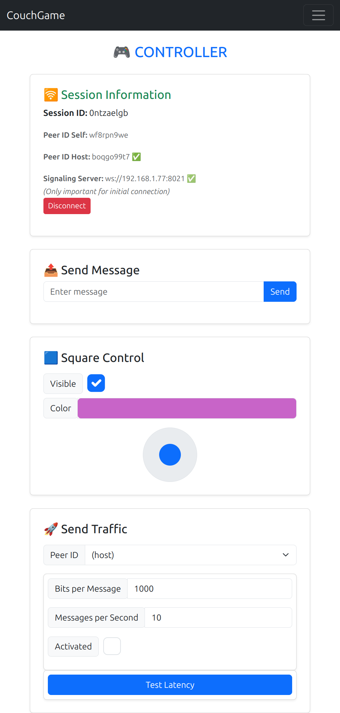
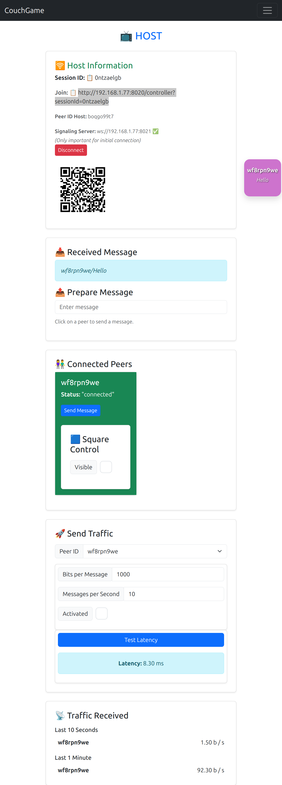

# CouchGameWebRTC

CouchGameWebRTC is a multiplayer application that uses **WebRTC** for real-time communication between a host (e.g., Fire TV) and multiple controllers (e.g., phones or computers). The project is designed for smooth, low-latency interactions, making it ideal for games or collaborative applications. It requires internet for initial loading and connection between the host and controllers, but after that, data is transferred only on the local Wi-Fi/network.

## Features

- **Real-Time Communication**: Peer-to-peer communication using WebRTC.
- **Host and Controller Roles**:
    - **Host**: Manages sessions and interactions (e.g., Fire TV).
    - **Controllers**: Devices (e.g., phones, computers) that send inputs to the host.
- **WebSocket Signaling Server**: Handles session management and signaling for WebRTC connections.
- **Performance Benchmarks**: Detailed metrics for latency, bandwidth, and message rates.
- **Session Persistence**: Host remembers the session using local storage for easy reuse.
- **QR Code Support**: Host presents a QR code for the controller URL.
- **Screen Wake Lock**: Uses wake lock when possible to prevent the screensaver.
- **Server Side Rendering**: For improved performance and SEO.

  


## Technologies Used

- **Angular**: Frontend framework for building the UI.
- **WebRTC**: Peer-to-peer communication protocol.
- **WebSocket**: For signaling and session management.
- **Node.js**: Backend signaling server.

## Usage

1. Start the host (e.g., Fire TV or browser).
2. Connect controllers (e.g., phones or computers) to the host.
3. Interact with the application in real-time.

## Build

```bash
ng build --configuration production
```

## Run Locally

0. **Install Dependencies**  
    ```bash
    npm install
    ```

1. **Start the Signaling Server**  
    ```bash
    node server-signaling.js
    ```

2. **Verify Signaling Server Port**  
    Ensure the signaling server port is correctly configured in `src/environments/environment.ts`.

3. **Run the Angular Application (no SSR)**  
    Start the Angular app, making it accessible to any device on the network:  
    ```bash
    ng serve --host 0.0.0.0 --disable-host-check --port 4200
    ```
4. **Run the Angular Application (with SSR)**  
    Start the Angular app with server-side rendering, making it accessible to any device on the network and specifying a port:  
    ```bash
    npm run serve:ssr:couch-game-WebRTC --host 0.0.0.0 --disable-host-check --port 4200
    ```

## Debugging

Use `chrome://webrtc-internals/` to debug WebRTC connections.

## Benchmark

### 20250331 v0.1.0 

| Wi-Fi  | Host         | Controller 1     | Controller 1 Bits/Message | Controller 1 Messages/s | Controller 2     | Controller 2 Bits/Message | Controller 2 Messages/s | Controller 3     | Controller 3 Bits/Message | Controller 3 Messages/s | Observation                                                                 |
|--------|--------------|------------------|---------------------------|-------------------------|------------------|---------------------------|-------------------------|------------------|---------------------------|-------------------------|--------------------------------------------------------------------------------|
| 1104   | Fire TV Silk | Phone           | 0                         | 0                       | Computer         | 0                         | 0                       | Computer         | 0                         | 0                       | Square movement fluid. Latency around 5ms-20ms.                                 |
| 1104   | Fire TV Silk | Phone           | 1000                      | 100                     | Computer         | 1000                      | 100                     | Computer         | 1000                      | 100                     | Square movement fluid. Latency around 5ms-20ms.                                 |
| 1104   | Fire TV Silk | Phone           | 10000                     | 10                      | Computer         | 10000                     | 10                      | Computer         | 10000                     | 10                      | Square movement fluid. Latency around 5ms-20ms. Receiving expected 3x107kb/s.   |
| 1104   | Fire TV Silk | Phone           | 10000                     | 100                     | Computer         | 10000                     | 100                     | Computer         | 10000                     | 100                     | Square movement fluid. Latency around 30ms-80ms. Receiving expected 3x1Mb/s.    |
| 1104   | Fire TV Silk | Phone           | 1000                      | 200                     | Computer         | 1000                      | 200                     | Computer         | 1000                      | 200                     | Square movement fluid. Latency around 10ms-40ms. Receiving expected 3x214kb/s.  |
| 1104   | Fire TV Silk | Phone           | 100000                    | 100                     | Computer         | 100000                    | 100                     | Computer         | 100000                    | 100                     | Overloaded. Latency around 5s-20s. Max=3x1Mb/s.                                  |
| 1104   | Fire TV Silk | Phone           | 1000                      | 1000                    | Computer         | 1000                      | 1000                    | Computer         | 1000                      | 1000                    | Square movement fluid. Latency around 10ms-40ms. TV blocked at 3x268kb/s when expecting 3x1Mb/s. |
| 1104   | Fire TV Silk | Phone           | 1000                      | 10000                   | Computer         | 1000                      | 10000                   | Computer         | 1000                      | 10000                   | Square movement fluid. Latency around 10ms-40ms. Max messages lost. Two controllers on PC crash after 1 min (probably RTC queue full). |

## License

This project is licensed under the MIT License.
